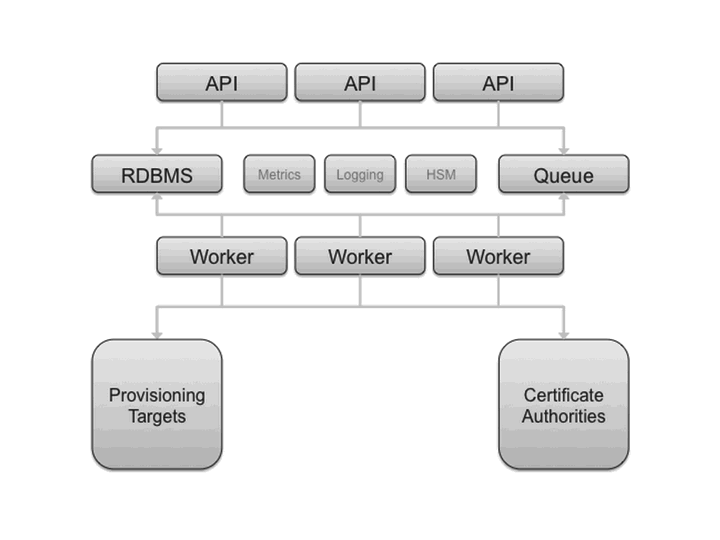
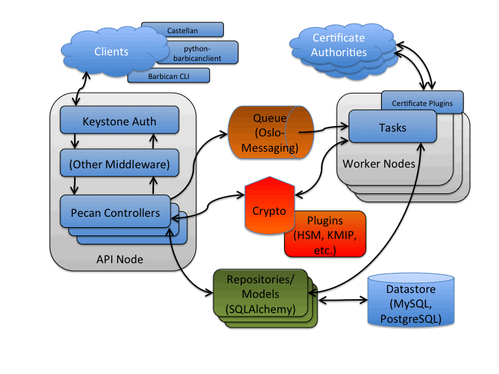

Architecture
============

This document describes the architecture and technology selections for
Barbican. In general, a goal is to utilize the OpenStack architecture and
technology selections as much as possible. An overall architecture is presented
first, followed by technology selection details to implement the system.

Overall Architecture
--------------------

The next figure presents an overall logical diagram for Barbican.

The API node(s) handle incoming REST requests to Barbican. These nodes can
interact with the database directly if the request can be completed
synchronously (such as for GET requests), otherwise the queue supports
asynchronous processing by worker nodes. The latter could include interactions
with third parties such as certificate authorities. As implied in the diagram,
the architecture supports multiple API and worker nodes being added/removed
to/from the network, to support advanced features such as auto scaling.
Eventually, the database could be replicated across data centers supporting
region-agnostic storage and retrieval of secured information, albeit with lags
possible during data synchronization.

Technology Selection
--------------------

In general, components from the `Oslo <https://wiki.openstack.org/wiki/Oslo>`_
commons project are used within Barbican, such as config, messaging and
logging.

The next figure examines the components within Barbican.

Several potential clients of the Barbican REST interface are noted, including
`Castellan <https://github.com/openstack/castellan>`_ which presents a generic
key management interface for other OpenStack projects with Barbican as an
available plugin.

The API node noted in the previous section is a WSGI server. Similar to
OpenStack projects such as
`Glance <https://docs.openstack.org/glance/latest/>`_ it utilizes paste to
support configurable middleware such as to interface with
`Keystone <https://docs.openstack.org/keystone/latest/>`_ for authentication
and authorization services. `Pecan <http://pecan.readthedocs.org/en/latest>`_
(a lean Python web framework inspired by CherryPy, TurboGears, and Pylons) is
utilized to map resources to REST routes. These resources contain the controller
business logic for Barbican and can interface with encryption/decryption
processes (via crypto components), datastore (via repository components) and
asynchronous tasks (via queue components).

The crypto components provide a means to encrypt and decrypt information that
accommodates a variety of encryption mechanisms and cryptographic backends (such
as key management interoperability protocol (KMIP) or hardware security
module (HSM)) via a plugin interface.

The repository components provide an interface and database session context for
the datastore, with model components representing entities such as Secrets
(used to store encrypted information such as data encryption keys).
`SQLAlchemy <http://www.sqlalchemy.org>`_ is used as the object relational
model (ORM) layer to the database, including
`MySQL <https://www.mysql.com/>`_ and
`PostgreSQL <http://www.postgresql.org>`_.

For asynchronous processing,
`Oslo Messaging <https://wiki.openstack.org/wiki/Oslo/Messaging>`_ is
used to interact with the queue, including
`RabbitMQ <https://www.rabbitmq.com/>`_. The worker node processes tasks
from the queue. Task components are similar to API resources in that they
implement business logic and also interface with the datastore and follow on
asynchronous tasks as needed. These asynchronous tasks can interface with
external systems, such as certificate authorities for SSL/TLS certificate
processing.
